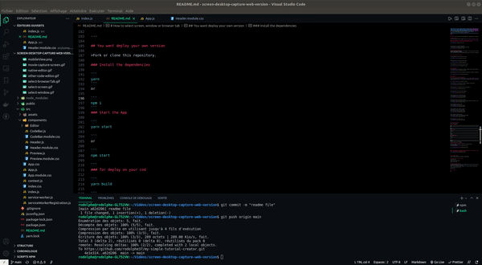
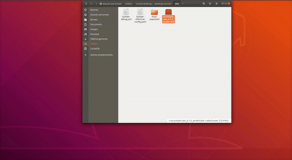

 

[](https://github.com/rodolphe37/my-simple-cam-dektop-app/blob/main/LICENSE)
[](https://github.com/rodolphe37/my-simple-cam-dektop-app/graphs/commit-activity)
[](https://www.javascript.com/)
[](https://github.com/rodolphe37/my-simple-cam-dektop-app/issues)
[](https://open.vscode.dev/rodolphe37/my-simple-cam-dektop-app)
[](https://github.com/Naereen/badges/)


---

## Widget Created with Electron.js & React.js


#  My Simple Cam
([My Simple Tutorial Creator](https://github.com/rodolphe37/my-simple-tutorial-creator) widget)

---

## What is it?
>**This is a cam widget which has the particularity of always staying in front of other windows, be it your browser or any other window.**
>
>I designed it as an widget for the "My Simple Tutorial Creator" application but, you can use only this widget and record video with others solution.



---

## **:heavy_exclamation_mark: Your operating system version, Linux, MacOs & Windows.**


>All files are compressed in .zip format
>---
>>***Linux - Download the .deb file [Here](https://github.com/rodolphe37/my-simple-cam-dektop-app-dektop-app/blob/main/widget-versions/linux/my-simple-cam-dektop-app_0.1.0_amd64.deb?raw=true)***
>>
>>>Unzip the file, double click on it!
>>>
>>>And that's it, it's installed.
>>
>>---
>>
>>***Mac - Download the .dmg file [Here](https://drive.google.com/file/d/1Uq5U5pRACU2W1XQzrr7gK_PUwRV1a5vv/view?usp=sharing)***
>>
>>>For the MacOs version, you do not have to install anything.
>>>
>>>Just unzip the file and copy the icon to your application folder.
>>
>>---
>>
>>***Windows - Download the .exe file [Here](https://drive.google.com/file/d/1SbZFpwP_kkvw8yMCjM4Nfy1zoXWQR2Ch/view?usp=sharing)***
>>
>>>Unzip the file, double click on it!
>>>
>>>And that's it, it's installed.
---

## :heavy_exclamation_mark: Demo on Ubuntu (.deb - all debian versions)

### Installation:



### Start the widget:


## :heavy_exclamation_mark:  How to uninstall the widget on Ubuntu (Linux)?

> You can uninstall the app with:

```
sudo apt-get remove my-simple-cam

```

---

## :heavy_exclamation_mark:  How to uninstall the widget on Mac?

> Just delete the app icon on application folder

---

## :heavy_exclamation_mark:  How to uninstall the widget on Windows?

> The classic way, like all other Windows applications.

---


## :bust_in_silhouette: Author

- Thought, designed and developed with :purple_heart: by Rodolphe Augusto

---

## :large_blue_diamond: A few words from the author

Enjoy the World :smirk:

---

## :sparkling_heart: Support the project

I put almost everything open-source I can, and try to accommodate anyone who needs help using these projects. Obviously,
this takes time. You can use this service for free.

However, if you are using this project and are happy with it or just want to encourage me to keep creating: -

- Put a star and share the project :rocket:

Thank you! :heart:

---

## :scroll: License

MIT

---
